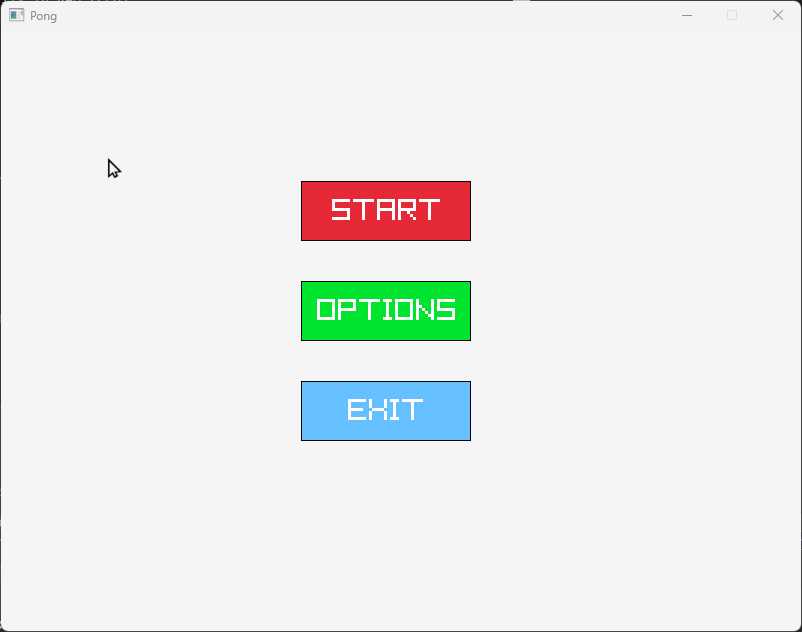
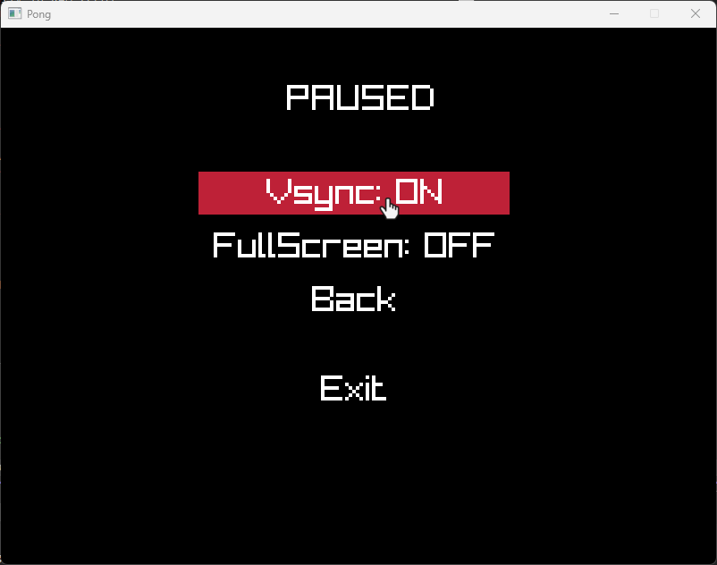
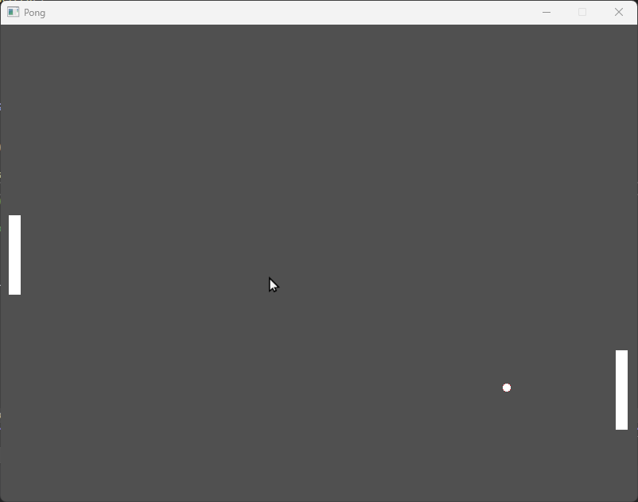

# Getting Started

## Raylib Dependency
* Go to raylib repository https://github.com/raysan5/raylib and follow the Windows instructions with vcpkg for the easiest install
* If you're a noob go to releases and download raylib v5.0 and install this other way

### I'm a noob, please help!
Fear not, my child, just follow this simple steps

* Clone the repository with git clone https://github.com/r4vendust/Pong.git
* Open the project with Visual Studio 2022 by clicking on the Pong.sln
* Right click on Pong (the project) and properties
* Under C/C++ and General tab, add the include folder from Raylib v5.0
* Go to the Linker/General and add the lib folder
* On the Linker/Input tab add raylib.lib, winmm.lib and gdi32.lib and it'll be something like this "raylib.lib;winmm.lib;gdi32.lib;$(CoreLibraryDependencies);%(AdditionalDependencies)" don't forget the semicolon
* Compile and Run

# Preview

## Main Menu

## Options

## In-Game

